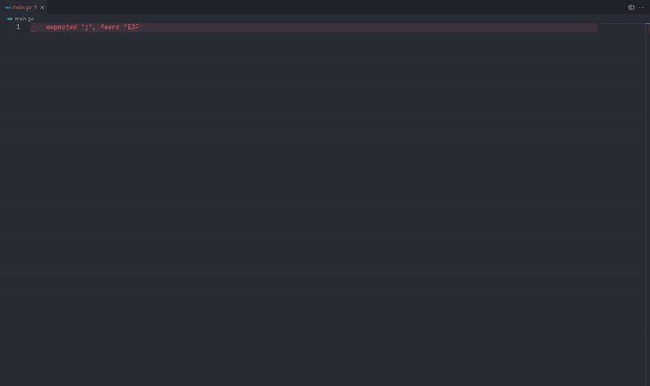
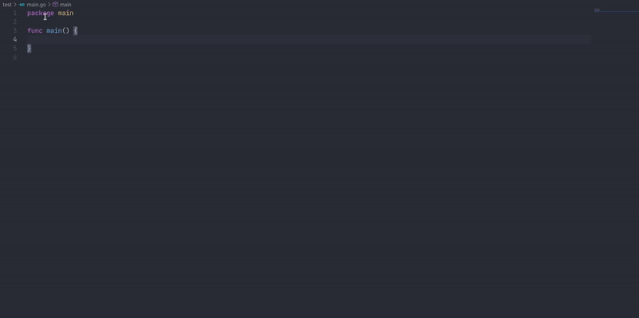

# Go Power for vscode
More snippets for fast codes with golang for VSCode with Go Power.

## Snippets Table

- [Main Snippets](./snippets/main.md)
- [Fiber Snippets](./snippets/fiber.md)

 
<em>Go Power Snippet sample</em>

## Changelogs v1.1.2
- Add channel send and receiver (snippet ch)

 

### ToDo
- [x] Main
- [x] Fiber
- [ ] Iris
- [ ] Gin
- [ ] Echo
- [ ] Fasthttp
- [ ] Gorm
- [ ] Cobra
- [ ] Go-kit
- [ ] Zap
- [ ] Logrus
- [ ] Gorilla mux, websocket
- [ ] More ...

